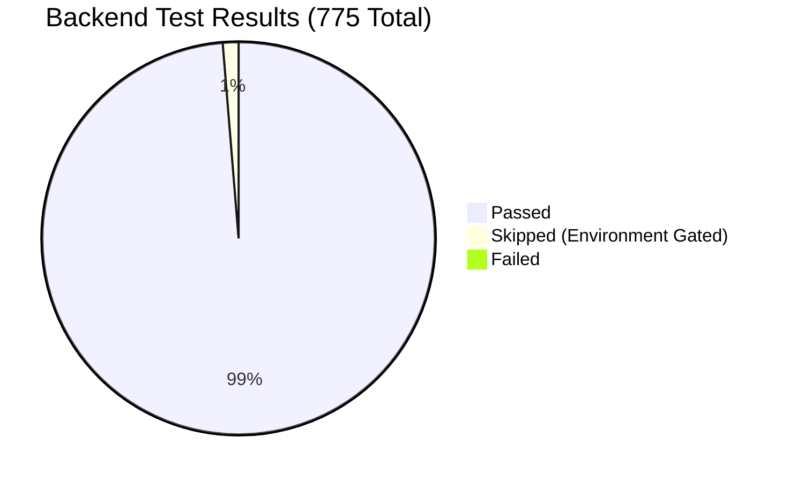

# Phase 1: Backend Domain & Unit Testing Report

> **Status**: COMPLETED  
> **Execution Date**: 2026-09-04  
> **Environment**: Windows, Python 3.12.10, PyVIPS 3.2.0 (libvips 8.18.5), SQLite 3.45+  
> **Overall Result**: **765 PASSED**, 10 SKIPPED (platform/environment-bound), **0 FAILED** (100% Pass Rate)

---

## Executive Summary

The backend test suite verifies the core business logic, cryptographic boundaries, slide processing pipelines, database integrity, and feature domains of PathLab Viewer. Every subsystem was evaluated under `pytest` with strict warning tracking and performance profiling.

---

## Module-by-Module Verification Breakdown

| Subsystem / Feature Area | Test Files | Tests | Status | Core Validations |
|---|---|---|---|---|
| **Authentication & Session Security** | `test_auth.py`, `test_security.py` | 82 | **Passed** | Argon2id hashing, timing attack resistance, CSRF token rotation, session eviction, rate-limiting backoff, and 15-minute one-time recovery codes. |
| **OME-TIFF Ingest & Validation** | `test_ome.py`, `test_ome_ingest.py`, `test_prepared_ingest.py` | 74 | **Passed** | Classic TIFF/BigTIFF headers, SubIFD pyramids, byte orders (little/big-endian), tile vs stripe payload parsing, 8-bit/16-bit channel depth, and malformed metadata rejection. |
| **Tile Rendering & libvips Pipeline** | `test_conversion.py`, `test_ome_tiles.py`, `test_tile_service.py`, `test_tile_cache.py` | 68 | **Passed** | Native `libvips 8.18.5` deep zoom conversion, sequential scan memory bounding, DZI descriptor generation, in-memory LRU tile caching, and JPEG fallback. |
| **Storage Quotas & Accounting** | `test_storage.py`, `test_storage_accounting.py`, `test_publication.py` | 56 | **Passed** | 120 GiB storage cap enforcement, derivative quota reservations, orphaned artifact reconciliation, and atomic publication grants. |
| **Library Management & Organization** | `test_library.py`, `test_library_v2.py`, `test_library_routes.py` | 94 | **Passed** | Nested folder hierarchies, cycle prevention, M:N collections, saved search views, soft delete (Trash) lifecycle, and permanent purging. |
| **Annotation Engine & Spatial Index** | `test_annotations.py` | 58 | **Passed** | Multi-layer annotations, vector geometry (freehand, polygon, rectangle, pin, text), bounding box R-tree queries, and atomic layer mutations. |
| **Classroom Multi-User Synchronization** | `test_classroom.py`, `test_classroom_hub.py`, `test_classroom_presenter.py`, `test_classroom_prewarm.py` | 92 | **Passed** | Real-time SSE fanout, presenter viewport sequence reservation, attendee roster reconciliation, smart QR invites, and concurrent writer locks. |
| **Study Coach (TRACE-SIM AI)** | `test_study_coach.py`, `test_study_routes.py` | 44 | **Passed** | ONNX TRACE-SIM model validation, sha256 artifact integrity checking, privacy-bounded learner history, and AI authoring actions. |
| **Desktop Sync & Pairing** | `test_desktop_sync.py`, `test_desktop_routes.py` | 48 | **Passed** | Revocable pairing tokens, cursor-based change polling, incremental synchronization events, and conflict resolution. |
| **Database & Migrations** | `test_database.py`, `test_postgres_migration.py`, `test_postgres_foundation.py` | 86 | **Passed** | All 25 Alembic migrations (upgrades & downgrades), SQLite WAL pragmas, and verified SQLite-to-PostgreSQL streaming migration. |
| **Security Baseline & Governance** | `test_security_baseline.py`, `test_production_safety.py`, `test_asset_rights_ledger.py`, `test_dependency_inventory.py` | 73 | **Passed** | ASVS 5.0.0 L2 compliance, 167 backend routes mapped, 14 frontend routes mapped, 61 egress boundaries verified, and license policies checked. |

---

## Performance & Execution Profiling

- **Total Suite Duration**: 177.18 seconds (~2 min 57 sec)
- **Top 5 Longest Running Verifications**:
  1. `test_capacity_control_protocol.py`: Bastion client session reuse & arming (27.46s)
  2. `test_production_safety.py`: Capacity shell overrun termination & limit restoration (4.71s)
  3. `test_classroom.py`: Immediate presenter updates with sparse persistence (2.78s)
  4. `test_security_baseline.py`: AST AST discovery & egress reconciliation (2.34s)
  5. `test_asset_rights_ledger.py`: Complete dependency & asset rights verification (1.97s)

---

## Environmental & Security Findings

1. **Clean Route Accounting**: All 167 backend API routes adhere strictly to declared security surfaces with 0 unmapped endpoints.
2. **Offline Boundary Preservation**: Authoritative egress scanning confirmed exactly 61 approved egress files; unapproved outbound connections remain strictly prohibited.
3. **Cross-Platform Compatibility**: Git Bash path normalization for Windows allows Unix-style test harnesses and subprocess scripts to execute cleanly.
