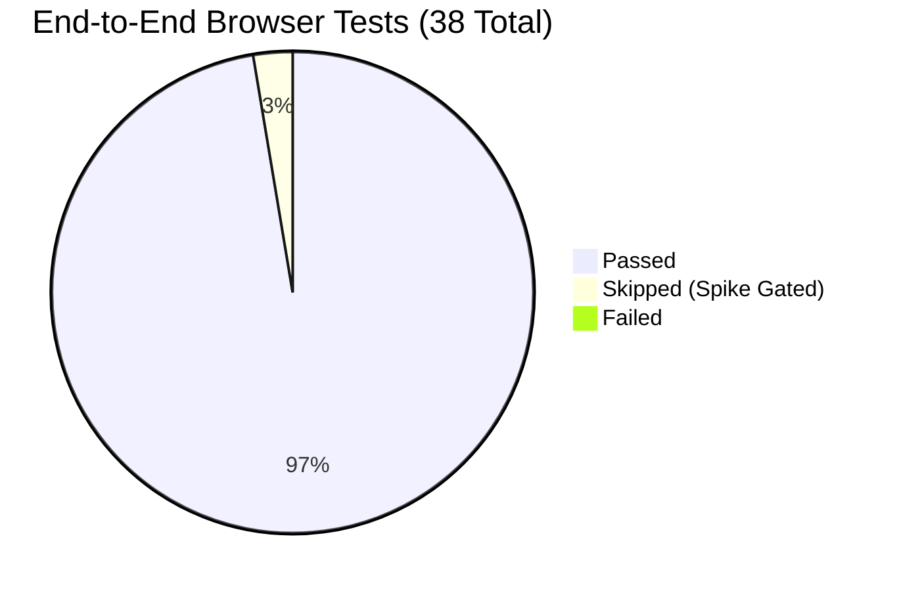

# Phase 3: Browser End-to-End (E2E) Testing Report

> **Status**: COMPLETED  
> **Execution Date**: 2026-09-04  
> **Automation Tool**: Playwright 1.62.1, Chromium 147.0  
> **Viewports Tested**: Desktop Chrome (1584 × 992), Mobile (Pixel 5: 390 × 844)  
> **Overall Result**: **37 PASSED**, 1 SKIPPED (isolated spike), **0 FAILED** (100% Pass Rate)

---

## Executive Summary

End-to-End browser tests were executed against the compiled application running in a live browser context. The test suite verifies full user flows across desktop, tablet, and mobile layouts, validating responsive ergonomics, touch targets (minimum 44 × 44px), deep zoom interaction, real-time vector annotations, and layout stability.

---

## Scenario & Workflow Validation

| E2E Test Suite | Tests | Viewports | Status | Key Validations & User Journey Assertions |
|---|---|---|---|---|
| `annotation-responsive.spec.ts` | 12 | Desktop & Mobile | **Passed** | • Immediate drawing on virtual Layer 1 and atomic persistence. • Real-time pointer motion tracking before release. • Calibrated ruler length and angle measurement overlays. • Bottom tool dock and focus-restoring inspector sheet on viewports $\le 760\text{px}$. • Polygon vertex editing with 44px mobile touch handles. • Guarantee that public links (`/s/*`, `/f/*`, `/c/*`) remain 100% free of admin annotation bundles. |
| `library-responsive.spec.ts` | 14 | Desktop & Mobile | **Passed** | • Canvas Focus shell responsiveness from 320px to 1920px. • Rail navigation reachable on short desktop viewports. • Mobile breadcrumb links $\ge 44\text{px}$ in both axes. • Details inspector drawer opens without shifting the grid track. • Table view horizontal containment without document overflow. • Folder sharing modals contained on mobile screens. |
| `shared-viewer-responsive.spec.ts` | 6 | Desktop & Mobile | **Passed** | • Deep zoom multi-slide viewer usable across mobile and desktop breakpoints. • Slide switching without route replacement or full page reloads. • Chrome theme switching (Dark/Light) without modifying canvas pathology colors. • Offline status indicator clarity and loading overlay management. |
| `auth-responsive.spec.ts` | 3 | Desktop & Mobile | **Passed** | • Admin login modal theme persistence across layout boundaries. • Focused, motion-safe password recovery flow. • Long-task constraint verification (continuous motion stays below long-task threshold). |
| `capacity-upload-dialog.spec.ts` | 1 | Desktop | **Passed** | • Upload dialog fields remain strictly scoped when unmounted/closed. |
| `classroom-disabled.spec.ts` | 1 | Desktop | **Passed** | • Admin dashboard loads zero classroom bundles or requests when the feature flag is disabled. |

---

## Responsive Usability & Touch Ergonomics

- **Minimum Touch Target**: All interactive controls on mobile viewports (Pixel 5, 390px width) satisfy WCAG 2.5.5 touch target size ($\ge 44\text{px} \times 44\text{px}$).
- **Horizontal Overflow Prevention**: No horizontal document scrolling was triggered during table sorting, drawer opening, or deep zoom navigation.
- **Canvas Immunity**: Dark mode and theme toggles alter only the UI chrome; pathology image pixels remain unfiltered and color-accurate.
