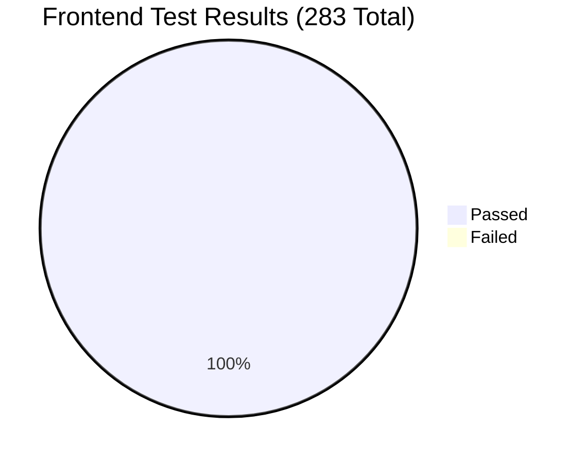

# Phase 2: Frontend Unit & Component Testing Report

> **Status**: COMPLETED  
> **Execution Date**: 2026-09-04  
> **Environment**: Windows, Node.js v24.19.0, pnpm 11.9.0, Vitest 4.1.10, React 19.2.8, JSDOM 30.0.1  
> **Overall Result**: **49 Passed / 49 Suites (100%)**, **283 Passed / 283 Tests (100%)**, **0 Failures**

---

## Executive Summary

The frontend test suite exercises all client-side UI workflows, OpenSeadragon viewport controls, SVG vector canvas rendering, offline draft persistence, real-time classroom state synchronization, and strict code-splitting performance budgets.

---

## Component & Domain Breakdown

| Feature Domain | Test Suites | Total Tests | Status | Core Assertions & Validations |
|---|---|---|---|---|
| **OpenSeadragon Core Viewer** | `viewer.test.tsx`, `shared-viewer.test.tsx`, `viewer-network.test.ts`, `viewer-performance-contract.test.ts` | 24 | **Passed** | Persistent OpenSeadragon instance reuse during slide navigation, unlisted public view isolation, DZI XML parsing, and network retry on dropped tiles. |
| **Annotation Vector Engine** | `annotation-workspace.test.tsx`, `annotation-workspace-stability.test.tsx`, `annotation-store.test.ts`, `annotation-overlay.test.ts`, `annotation-geometry.test.ts`, `annotation-drafts.test.ts`, `annotation-autosave.test.ts`, `annotation-interchange-api.test.ts`, `annotation-measurement-spatial.test.ts`, `annotation-performance-contract.test.ts`, `annotation-bundle-budget.test.ts` | 88 | **Passed** | Freehand, polygon, rectangle, pin, and text tools; spatial R-tree coordinate transformation; 25,000-object memory bounding; draft survival across unmount/reload; atomic duplicate/rebase; and JSON serialization limits. |
| **Slide Library Explorer** | `library-explorer.test.tsx`, `library-api.test.ts`, `library-performance-contract.test.ts`, `library-shell-preferences.test.ts`, `slide-details-panel.test.tsx` | 42 | **Passed** | Responsive compact rail, nested folder navigation, breadcrumbs, single-cursor windowing (previous pages restored from memory), batch move/tag/trash, and debounced search. |
| **Active-Learning Classroom** | `classroom-teacher-roster.test.tsx`, `classroom-student-sync-page.test.tsx`, `classroom-student-drawing.test.tsx`, `classroom-stream-sync.test.ts`, `classroom-presenter-viewport.test.ts`, `classroom-smart-invite.test.tsx`, `classroom-roster.test.ts`, `classroom-reconnect.test.ts`, `classroom-performance-contract.test.ts`, `classroom-folder-setup.test.tsx`, `classroom-pin-overlays.test.tsx`, `classroom-snapshot-reconciler.test.ts`, `classroom-notebook.test.ts` | 64 | **Passed** | Live SSE event stream parsing, presenter viewport replication, teacher participant roster windowing, student drawing overlays, and QR code smart invites. |
| **Admin & Security UI** | `admin.test.tsx`, `auth-performance-contract.test.ts`, `auth-responsive-contract.test.ts`, `publish-confirmation.test.tsx`, `share-dialog.test.tsx` | 22 | **Passed** | Password reveal/conceal, local validation, CSRF auto-refresh on 403, and explicit de-identification check gates before publishing. |
| **Upload Pipeline & Ingest** | `upload-workspace.test.tsx`, `upload-transport.test.ts`, `capacity-diagnostic.test.ts` | 10 | **Passed** | Multi-file OME-TIFF drag-and-drop chooser, sequential single-active upload queue, tus chunk streaming, and error classification. |
| **Theme & Utilities** | `theme.test.tsx`, `loader.test.tsx`, `desktop-connect.test.tsx`, `study-coach-contract.test.ts`, `vite-config.test.ts` | 33 | **Passed** | Dark/Light theme switching, token synchronization, CSS loading indicators, and desktop device pairing token displays. |

---

## Frontend Performance & Budget Contracts

- **Bundle Isolation**: `auth-performance-contract.test.ts` verifies that the public and unauthenticated sign-in chunk **does not** leak admin code or heavyweight dependencies (e.g. OpenSeadragon, ONNX runtime).
- **Scale Bounding**: `annotation-workspace-stability.test.tsx` proves that pointer coordinate updates across a 25,000-annotation layer execute **without** cloning or re-filtering the entire collection, preventing UI jank.
- **Single-Instance Viewer**: `shared-viewer.test.tsx` guarantees that slide transitions within a collection reuse the same OpenSeadragon canvas without WebGL context leaks or DOM rebuilding.
- **Production Build Outputs**:
  - `dist/index.html`: 0.51 kB (0.31 kB gzip)
  - `dist/assets/OpenSeadragonViewer-*.js`: 359.74 kB (92.08 kB gzip)
  - `dist/assets/index-*.js`: 241.67 kB (77.40 kB gzip)
  - `dist/assets/AnnotationWorkspace-*.js`: 171.14 kB (48.70 kB gzip)
