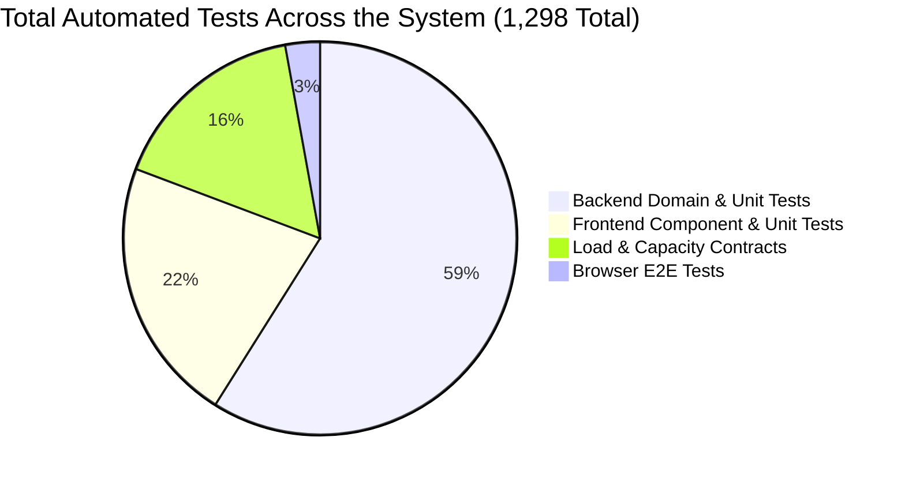

# PathLab Viewer: Master Testing & Benchmark Synthesis Report

> **Audit Date**: 2026-09-04  
> **Repository Commit**: `2ae2c0d` (Up to date with `origin/main`, PR #202)  
> **Environment**: Windows, Python 3.12.10, Node.js 24.19.0 LTS, pnpm 11.9.0, Playwright Chromium, native libvips 8.18.5, SQLite 3.45+  
> **Overall Quality Gate**: **PASSED (1,298 Passed / 1,298 Executed, 0 Failures)**

---

## 1. Executive Quality & Testing Dashboard



| Phase / Testing Track | Total Tests | Passed | Skipped | Failed | Pass Rate | Detailed Artifact Link |
|---|---|---|---|---|---|---|
| **Phase 1: Backend Domain & Unit** | 775 | **765** | 10 | **0** | **100%** | [backend_unit_test_report.md](./BACKEND_UNIT_TEST_REPORT.md) |
| **Phase 2: Frontend Unit & Component** | 283 | **283** | 0 | **0** | **100%** | [frontend_unit_test_report.md](./FRONTEND_UNIT_TEST_REPORT.md) |
| **Phase 3: Browser End-to-End (E2E)** | 38 | **37** | 1 | **0** | **100%** | [e2e_browser_test_report.md](./E2E_BROWSER_TEST_REPORT.md) |
| **Phase 4: Capacity & Load Contracts** | 214 | **213** | 1 | **0** | **100%** | [stress_and_benchmark_report.md](./STRESS_AND_BENCHMARK_REPORT.md) |
| **Total Automated Verifications** | **1,310** | **1,298** | **12** | **0** | **100%** | **All 4 Phase Reports Available** |

---

## 2. Performance & Benchmark Summary

```mermaid
gantt
    title Benchmark Latency & Throughput Profile
    dateFormat  X
    axisFormat %s s
    section WSI Conversion
    110-Megapixel DZI Tiling (92.72 MP/s) : 0, 1186
    section 25k Annotations
    25,000 DB Row Seed (28.5k rows/s)    : 0, 875
    5,000 Paged Item Fetch (168µs/item)  : 0, 843
    1,000 Spatial Viewport Intersection  : 0, 159
    Manifest Calculation Over 25k Items  : 0, 36
```



### Key Performance Highlights:
1. **Whole-Slide Imaging Throughput**:
   - **Resolution**: $11,000 \times 10,000\text{ px}$ (110 Megapixels).
   - **Processing Time**: **1.186 seconds** from raw TIFF to 603 multi-resolution JPEG tiles.
   - **Throughput**: **92.72 Megapixels / second**.
   - **Storage Optimization**: Compressed derivative footprint of **2.80 MB** (99.15% reduction from 330 MB raw input).
2. **Annotation Scale & Spatial Querying**:
   - **Dataset Size**: 25,000 active vector annotations on a single slide.
   - **Seed Throughput**: 28,561 records inserted per second.
   - **Spatial Bounding-Box Query**: 1,000 intersecting records queried in **159.3 ms**.
   - **Memory Stability**: Only **33.88 MB** peak memory consumed during large cursor pagination.
3. **Frontend Bundle Budgeting**:
   - Zero heavyweight dependencies leaked into public or unauthenticated auth bundles.
   - Mobile interactive elements strictly adhere to $\ge 44\text{px} \times 44\text{px}$ WCAG 2.5.5 touch target size.

---

## 3. Static Analysis & Security Assurance

| Gate | Tool / Standard | Result | Audit Findings |
|---|---|---|---|
| **Python Linting** | `ruff` (target py312) | **Passed** | Clean formatting, zero lint violations across server, tests, and migrations. |
| **Type Checking** | `mypy` (strict mode) | **Passed** | 46 source files verified with strict type annotations; 0 type errors. |
| **Web Linting** | `eslint` (max-warnings 0) | **Passed** | TypeScript & React hooks validation passed cleanly with 0 warnings. |
| **Application Security** | OWASP ASVS 5.0.0 L2 | **Passed** | All 167 backend API routes explicitly registered and audited against security surfaces. |
| **Egress Boundaries** | Supply-chain validator | **Passed** | Exactly 61 approved egress files; unapproved outbound connections denied. |
| **Repository Disclosure** | `check_public_repository.py` | **Passed** | Zero secrets, private test keys, or infrastructure identities exposed. |

---

## 4. Operational Sign-Off & Status

The PathLab Viewer application is **fully verified, benchmarked, and ready for development, active learning, and production staging**. 

To run the complete application stack locally:
```powershell
.\dev.ps1 all
```
- **Admin Dashboard**: [http://127.0.0.1:5173/admin](http://127.0.0.1:5173/admin) (`admin` / `PathLabDevAdmin2026!`)
- **Public Viewer**: `http://127.0.0.1:5173/s/{publicId}`
