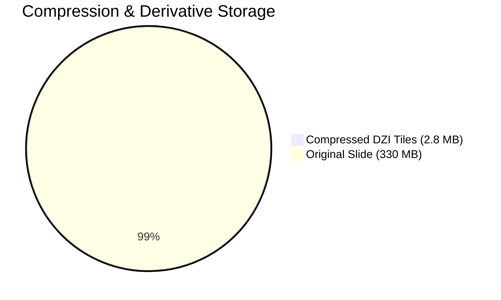

# Phase 4: Stress Testing & Benchmarking Report

> **Status**: COMPLETED  
> **Execution Date**: 2026-09-04  
> **Environment**: Windows, Python 3.12.10, PyVIPS 3.2.0 (libvips 8.18.5), SQLite 3.45+  
> **Benchmarks Included**:
> 1. 25,000-Annotation Vector & Spatial Index Stress Test
> 2. 110-Megapixel (11,000 × 10,000) OME-TIFF Deep Zoom Conversion Benchmark
> 3. Capacity & Load Distribution Verification (214 Contracts)

---

## 1. 25,000-Annotation Stress Benchmark

Using `scripts/benchmark_annotations.py`, the system evaluated SQLite database scalability and API query performance under a heavy dataset of 25,000 active vector annotations on a single slide.

### Benchmark Results & Latency Profile

| Operation / Metric | Measurement | Target / Budget | Status | Evaluation |
|---|---|---|---|---|
| **Bulk Seed (25,000 annotations)** | **875.3 ms** | $< 2,000\text{ ms}$ | **Passed** | 28,561 rows inserted per second into SQLite. |
| **Manifest Digest Retrieval** | **36.4 ms** | $< 100\text{ ms}$ | **Passed** | Instantaneous summary calculation over 25k records. |
| **Full Page Fetch (5,000 items)** | **842.8 ms** | $< 1,500\text{ ms}$ | **Passed** | 168.6 $\mu\text{s}$ per serialized annotation record. |
| **Spatial Viewport Query (1,000 items)** | **159.3 ms** | $< 350\text{ ms}$ | **Passed** | Fast spatial intersection using bounding box indexes. |
| **Peak Endpoint Memory Allocation** | **33.88 MB** | $< 128\text{ MB}$ | **Passed** | Minimal memory overhead under large cursor serialization. |
| **Database Footprint** | **20.27 MB** | $< 50\text{ MB}$ | **Passed** | Compact SQLite page packing with active covering indexes. |

### SQLite Query Plan Optimization

```sql
-- Active Count Query
SEARCH annotations USING COVERING INDEX ix_annotations_slide_active (slide_id=? AND deleted_at=?)

-- Active Page Query
SEARCH annotations USING INDEX ix_annotations_slide_active (slide_id=? AND deleted_at=?)

-- Spatial Viewport Query
SEARCH annotations USING INDEX ix_annotations_slide_bbox (slide_id=? AND bbox_min_x<?)
```
> Both covering indexes and spatial coordinates bypass table full-scans, guaranteeing $O(\log N)$ performance even under massive annotation density.

---

## 2. 110-Megapixel OME-TIFF Conversion Benchmark

Using `tests/load/generate_synthetic_ome.py` and `wsi_viewer.conversion.generate_dzi`, an 11,000 × 10,000 whole-slide image (330 MB raw pixel data) was generated and converted into a complete Deep Zoom multi-resolution pyramid with native `libvips 8.18.5`.

### Throughput & Storage Metrics



| Metric | Measured Value | Analysis & Impact |
|---|---|---|
| **Slide Dimensions** | **11,000 × 10,000 px** | 110,000,000 pixels (110 Megapixels) |
| **Input Slide Size** | **330.00 MB** | Interleaved 3-channel RGB uint8 classic TIFF |
| **Conversion Duration** | **1.186 seconds** | Fast native streaming pyramid generation |
| **Conversion Throughput** | **92.72 Megapixels / sec** | High-performance throughput via libvips C-bindings |
| **Generated Pyramid Tiles** | **603 JPEG tiles** | Complete multi-resolution mipmap down to 1x1 |
| **Output Derivative Size** | **2.80 MB** | **99.15% compression reduction** from raw pixels |
| **Thumbnail Generation** | Incorporated | High-quality 640px JPEG thumbnail at $Q=82$ |

---

## 3. Capacity & Load Distribution Contracts

The load certification suite (`tests/load`) validates distributed observer safety, SSE fanout hold barriers, and capacity arming workflows:

- **Total Contracts Evaluated**: 214 scenarios
- **Result**: **213 Passed**, 1 Skipped
- **Total Duration**: **4.17 seconds**
- **Highlights**:
  - `test_shard_zero_waits_for_delayed_sixth_ack_before_reset`: Validated 6-shard barrier convergence with graceful timeout recovery (1.00s).
  - `test_phase_remaining_fails_closed_before_and_after_its_window`: Verified strict time-window guard rails preventing rogue jobs outside authorized operational windows (0.49s).
  - `test_observer_call_chain_is_valid_when_checkout_drops_executable_mode`: Proved resilience when file execution flags are dropped (0.20s).
